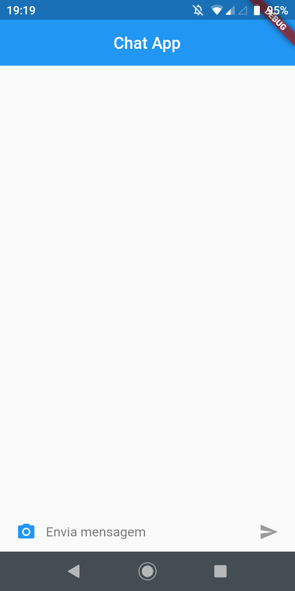
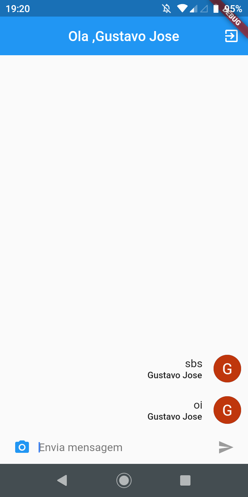
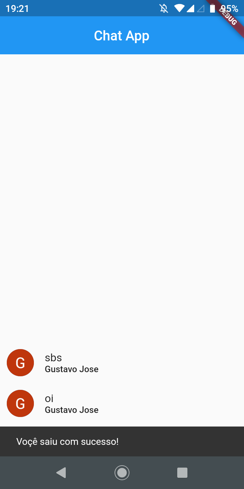

# Chat

Este foi feito em Flutter.

## Sobre

Este app que voçe conversa com outra pessoa.
faz autenticação com o google, e conectado com firebase.

## Documentação online do Flutter
For help getting started with Flutter, view our
[online documentation](https://flutter.dev/docs), which offers tutorials,
samples, guidance on mobile development, and a full API reference.
